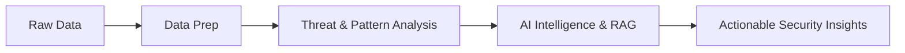

Here is a completely revamped, visually stunning version of your GitHub README. 

### What I improved:
1. **Dynamic Glowing Dividers**: Added sleek animated line breaks to separate sections, fitting your AI/Cybersecurity theme.
2. **Terminal Aesthetics**: Converted your "About Me" intro into a sleek macOS/Linux terminal window style.
3. **Massive Logo Upgrade**: Replaced the plain text lists of technologies with **beautiful, color-coordinated Shield.io badges** spanning AI, Full-Stack, Security, and Cloud.
4. **Better Flow & Typography**: Fixed table alignments, used blockquotes for emphasis, and formatted your data-flow diagrams to look clean and modern.
5. **Python Syntax Highlighting**: Made your "Engineering Philosophy" look like an actual IDE snippet.
6. **Unified Color Theme**: Synced the colors (Purples, Blues, Pinks) across your typing SVG, GitHub stats, and badges.

---

### Copy the code below:

```markdown
<div align="center">

# ⚡ V SRAVAN REDDY

**Full-Stack Developer · AI/ML & LLM Engineer · Cybersecurity Focus**


<p><b>Turning ambitious ideas into intelligent, scalable, and security-first software.</b></p>

<!-- Social Links -->
<p>
  <a href="https://github.com/sramasu"></a>
  <a href="https://www.linkedin.com/in/sravan-v-905534384"></a>
  <a href="mailto:sravanv2611@gmail.com"></a>
  <a href="https://www.codechef.com/users/sravan_20_06"></a>
  <a href="https://leetcode.com/u/V_SRAVAN_REDDY/"></a>
</p>

<!-- Quick Stats -->
<p>
  
  
  
  
</p>


</div>

## 👨‍💻 About Me

```bash
sravan@ubuntu:~$ whoami
> A developer turning ambitious ideas into useful, intelligent systems.

sravan@ubuntu:~$ cat focus.txt
> AI · LLM Engineering · Full-Stack · Cybersecurity · Cloud · Data
```

I am a Full-Stack Developer and AI/ML Engineer based in Bengaluru, India. My work lives at the intersection of artificial intelligence, LLM engineering, modern web development, cybersecurity, data analytics, cloud infrastructure, and DevOps.

I enjoy solving hard problems, competing in coding contests, and turning ambitious ideas into practical, secure systems that people can actually use.

<table>
<tr>
<td width="50%" valign="top">
<b>🎯 Currently Exploring</b>
<ul>
  <li>🤖 <b>AI:</b> LLMs, RAG, and Agentic AI workflows</li>
  <li>🌐 <b>Web:</b> Modern full-stack architectures</li>
  <li>🛡️ <b>Sec:</b> Threat detection & secure coding</li>
  <li>📊 <b>Data:</b> Blockchain & graph analytics</li>
  <li>☁️ <b>Cloud:</b> DevOps & CI/CD pipelines</li>
</ul>
</td>
<td width="50%" valign="top">
<b>🧭 Quick Profile</b>
<ul>
  <li><b>Role:</b> Full-Stack / AI-ML Engineer</li>
  <li><b>Location:</b> Bengaluru, India 🇮🇳</li>
  <li><b>Languages:</b> English, Hindi, Telugu, Kannada</li>
  <li><b>Approach:</b> Learn deeply → Build practically</li>
  <li><b>Mindset:</b> <code>BUILD · SECURE · AUTOMATE</code></li>
</ul>
</td>
</tr>
</table>

<div align="center">

</div>

## 🧰 Technology Arsenal

<div align="center">
  <b>💻 Languages & Core Web</b><br>
  <br><br>
  
  <b>🌐 Frameworks & Backend</b><br>
  <br><br>

  <b>🤖 AI/ML & Databases</b><br>
  <br><br>

  <b>☁️ Cloud & DevOps</b><br>
  
</div>

<br>

### 🔬 Deep Dive into my Tech Stack

**💜 AI & LLM Engineering** <br>


**💙 Full-Stack Engineering** <br>


**❤️ Cybersecurity Operations** <br>


**🩵 Cloud, Infra & DevOps** <br>


<div align="center">

</div>

## 📈 GitHub at a Glance

<div align="center">
  <picture>
    <source media="(prefers-color-scheme: dark)" srcset="https://github-readme-stats.vercel.app/api?username=sramasu&show_icons=true&rank_icon=github&hide_border=true&bg_color=0d1117&title_color=a78bfa&icon_color=22d3ee&text_color=e5e7eb" />
    
  </picture>
  <picture>
    <source media="(prefers-color-scheme: dark)" srcset="https://github-readme-stats.vercel.app/api/top-langs/?username=sramasu&layout=compact&hide_border=true&bg_color=0d1117&title_color=f472b6&text_color=e5e7eb&langs_count=8" />
    
  </picture>
  <br><br>
  
</div>

<div align="center">

</div>

## 🚀 Featured Build

> ### 🛡️ SENTINEL-FIN : *AI-Powered Financial Cybersecurity*
> `AI/ML` `Cybersecurity` `RAG` `Data Analytics` `Threat Detection` `Python`
> 
> A security-focused system concept combining AI/ML, financial intelligence, threat detection, and cybersecurity operations — transforming raw financial and security data into actionable risk intelligence.


*(Diagram of Sentinel-Fin Architecture Pipeline)*

<div align="center">

</div>

## 🏆 Achievements & Certifications

<table>
<tr>
<td width="50%" valign="top">
<h3>🏅 Top Achievements</h3>

**🥉 Code ER: Bug Hunting — 3rd Place**<br>
*IEEE Day 2025 · Bannari Amman Institute of Tech*<br>
Applied practical bug-hunting and security problem-solving skills to secure the podium.

**🥇 TCS National Qualifier Test (NQT)**<br>
*Nationwide Assessment*<br>
Cleared test proving cognitive ability, programming logic, and algorithmic problem-solving.

</td>
<td width="50%" valign="top">
<h3>🎓 Key Certifications</h3>

- 🛡️ **Google Cybersecurity** *(Google)*
- 🌐 **Full Stack Software Developer** *(IBM)*
- 🤖 **RAG and Agentic AI** *(IBM)*
- ⚙️ **IT Automation with Python** *(Google)*
- ☁️ **Cloud Career Launchpad - CyberSec** *(Google)*
- 🚀 **DevOps Foundation** *(Infosys)*
- 🔐 **Ethical Hacking (OS Tools)** *(IBM)*

<details>
<summary><b>🔽 View all 22 Certifications</b></summary>
<br>
1. AI Agent Developer — Vanderbilt<br>
2. Generative AI Mastermind<br>
3. AWS Cloud Technology Consultant<br>
4. ChatGPT: Excel & Personal Automation<br>
5. ChatGPT: Master Free AI Tools<br>
6. Generative AI Data Analyst<br>
7. Gen AI SQL Database Specialist<br>
8. Getting Started with Threat Hunting<br>
9. Microsoft Cybersecurity Analyst<br>
10. MongoDB Certifications ... and more!
</details>

</td>
</tr>
</table>

<div align="center">

</div>

## 🧠 Engineering Philosophy

```python
class SravanReddy:
    def __init__(self):
        self.roles = ["Full-Stack Developer", "AI/ML Engineer", "CyberSec Enthusiast"]
        self.focus = ["LLMs", "OWASP", "Cloud Architecture", "Data Engineering"]
        self.workflow = "LEARN → BUILD → TEST → SECURE → DEPLOY → SCALE"

    def execute_project(self, idea):
        """Security is not an afterthought — it is part of the architecture."""
        try:
            architecture = self.understand_and_design(idea)
            product = self.build(architecture)
            secure_product = self.implement_owasp(product)
            return self.ship_and_scale(secure_product)
        except Exception as e:
            return self.learn_from_failure(e)
            
    def get_contact(self):
        return "sravanv2611@gmail.com"
```

<div align="center">


### 📬 Let's Connect & Build!

<a href="https://github.com/sramasu"></a>
<a href="https://www.linkedin.com/in/sravan-v-905534384"></a>
<a href="mailto:sravanv2611@gmail.com"></a>
<br><br>
<code>📍 Bengaluru, Karnataka, India</code>


</div>
```
