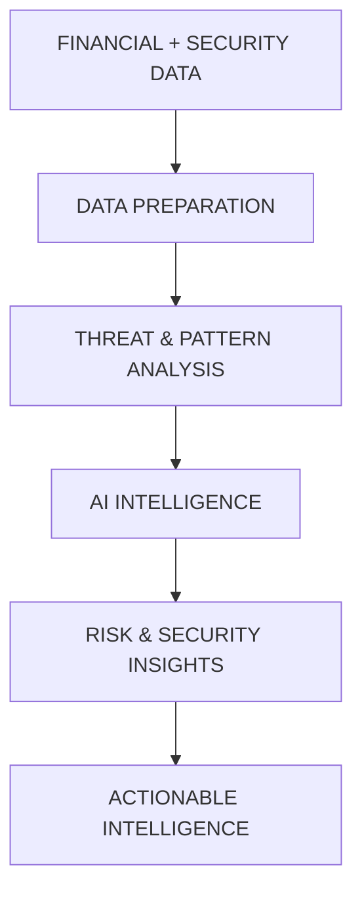

<div align="center">

# <span style="color:#8B5CF6">⚡ V SRAVAN REDDY ⚡</span>

</div>
<div align="center">


<br>
  
  <h3><b>Full Stack Developer &middot; AI/ML &amp; LLM Engineer &middot; Cybersecurity Focus</b></h3>

  <p>
    <a href="https://github.com/sramasu"></a>
    <a href="https://www.linkedin.com/in/sravan-v-905534384"></a>
    <a href="mailto:sravanv2611@gmail.com"></a>
    <a href="https://www.codechef.com/users/sravan_20_06"></a>
    <a href="https://leetcode.com/u/V_SRAVAN_REDDY/"></a>
  </p>

  <p><b>Building scalable, intelligent and security-first digital systems.</b></p>

  <p>
    
    
    
    
  </p>

  
</div>

## 👋 About Me

```bash
$ whoami
> A developer turning ambitious ideas into useful, intelligent systems.

$ cat focus.txt
> AI · LLM Engineering · Full-Stack · Cybersecurity · Cloud · Data
```

I am a Full-Stack Developer and AI/ML Engineer based in Bengaluru, India. My work lives at the intersection of artificial intelligence, LLM engineering, modern web development, cybersecurity, data analytics, cloud infrastructure, DevOps and blockchain analytics.

I enjoy solving hard problems, competing in coding contests, and turning ambitious ideas into practical, secure systems that people can actually use.

<table>
<tr>
<td width="50%" valign="top">
<b>🎯 Currently Exploring</b>
<ul>
  <li>🤖 LLMs, RAG and agentic AI systems</li>
  <li>🌐 Modern full-stack architecture</li>
  <li>🛡️ Threat detection &amp; secure coding</li>
  <li>📊 Data and blockchain analytics</li>
  <li>☁️ Cloud infrastructure and DevOps</li>
  <li>⚙️ Intelligent automation</li>
</ul>
</td>
<td width="50%" valign="top">
<b>🧭 Quick Profile</b>
<ul>
  <li><b>Role:</b> Full-Stack / AI-ML Engineer</li>
  <li><b>Location:</b> Bengaluru, Karnataka, India</li>
  <li><b>Languages:</b> English · Hindi · Telugu · Kannada</li>
  <li><b>Interests:</b> AI · Security · Cloud · Data</li>
  <li><b>Approach:</b> Learn deeply, then build practically</li>
  <li><b>Mindset:</b> Build · Secure · Automate · Innovate</li>
</ul>
</td>
</tr>
</table>

<div align="center">
  <h4><code>LEARN → BUILD → TEST → SECURE → DEPLOY → SCALE</code></h4>
  
</div>

## 🧰 Technology Arsenal

<table>
  <tr>
    <td width="50%" valign="top">
      <h3><code>&lt;/&gt;</code> Languages & Runtimes</h3>
      
      
      
      
      
      
      
      
    </td>
    <td width="50%" valign="top">
      <h3>🤖 AI & ML Engineering</h3>
      
      
      
      
      
      
      
      
      
      
      
      
      
      
    </td>
  </tr>
  <tr>
    <td width="50%" valign="top">
      <h3>🌐 Web Architecture</h3>
      
      
      
      
      
      
      
      
      
      
    </td>
    <td width="50%" valign="top">
      <h3>🗄️ Data & Blockchain Systems</h3>
      
      
      
      
      
      
      
      
      
      
      
      
      
      
    </td>
  </tr>
  <tr>
    <td width="50%" valign="top">
      <h3>🛡️ Cybersecurity Ops</h3>
      
      
      
      
      
      
      
      
      
      
      
      
      
      
      
    </td>
    <td width="50%" valign="top">
      <h3>☁️ Infra, Cloud & DevOps</h3>
      
      
      
      
      
      
      
      
      
      
      
      
      
    </td>
  </tr>
  <tr>
    <td width="50%" valign="top">
      <h3>✨ AI & LLM Platforms</h3>
      
      
      
      
      
      
      
      
      
      
      
    </td>
    <td width="50%" valign="top">
      <h3>🎓 Academic Core</h3>
      
      
      
      
      
      
      
      
      
    </td>
  </tr>
</table>

<div align="center">
  
</div>

## 📈 GitHub at a Glance

<div align="center">
  <picture>
    <source media="(prefers-color-scheme: dark)" srcset="https://github-readme-stats.vercel.app/api?username=sramasu&show_icons=true&rank_icon=github&hide_border=true&bg_color=0d1117&title_color=a78bfa&icon_color=22d3ee&text_color=e5e7eb" />
    
  </picture>
  <picture>
    <source media="(prefers-color-scheme: dark)" srcset="https://github-readme-stats.vercel.app/api/top-langs/?username=sramasu&layout=compact&hide_border=true&bg_color=0d1117&title_color=f472b6&text_color=e5e7eb&langs_count=8" />
    
  </picture>
  <br><br>
  
  <br>
  
</div>

<p align="center"><i>Note: Language cards show the languages used in public repositories — not experience level or proficiency.</i></p>

<div align="center">
  
</div>

## 🏗️ Engineering Domains

| Domain | What I Work With |
| :--- | :--- |
| 🤖 **AI / ML & LLM Engineering** | RAG · Agents · LangChain · Transformers · NLP · Deep Learning · Evaluation |
| 🌐 **Full-Stack Architecture** | React · Next.js · Node.js · Express · FastAPI · REST · WebSockets |
| 🛡️ **Cybersecurity** | OWASP · Secure Coding · Threat Detection · Vulnerability Assessment · SOC |
| 📊 **Data & Analytics** | SQL · Pandas · EDA · Data Mining · Graph and Blockchain Analytics |
| ☁️ **Cloud & DevOps** | AWS · Docker · Kubernetes · GitHub Actions · Linux · CI/CD · Vercel |

<details>
<summary><b>🤖 AI & LLM Applications</b></summary>
I explore and build applications using <code>LLMs</code>, <code>RAG</code>, <code>LangChain</code>, <code>Agentic AI</code>, <code>NLP</code>, <code>Transformers</code>, <code>Prompt Engineering</code>, <code>Model Evaluation</code> and <code>AI Automation</code>.
<pre><code>USER → PROMPT → LLM / AGENT → RETRIEVAL → KNOWLEDGE → REASONING → ACTION</code></pre>
</details>

<details>
<summary><b>🔐 Cybersecurity Interests</b></summary>
Vulnerability assessment · OWASP practices · Threat detection · Network analysis · Linux security · Authentication and encryption · SOC concepts · Ethical hacking · Security monitoring · Threat intelligence and hunting.
</details>

<details>
<summary><b>📊 Data & Blockchain Analytics</b></summary>
Data preprocessing · Exploratory data analysis · Data mining · Graph analytics · Blockchain analytics · Ethereum fundamentals · Cryptocurrency transaction analysis · Network analysis · Pattern recognition · SQL analytics · Python / Pandas workflows.
</details>

<div align="center">
  
</div>

## 🚀 Featured Build

<div align="center">
  <h3>🛡️ SENTINEL-FIN</h3>
  <h4>AI-Powered Financial Cybersecurity</h4>
  <p>
    <code>AI/ML</code> <code>Cybersecurity</code> <code>RAG</code> <code>Data Analytics</code> <code>Threat Detection</code> <code>Pattern Recognition</code> <code>Network Analysis</code>
  </p>
</div>

> A security-focused system concept combining AI/ML, financial intelligence, threat detection, analytics and cybersecurity operations — transforming raw financial and security data into actionable risk intelligence.



<div align="center">
  
</div>

## 🏅 Professional Certifications

Credentials spanning cybersecurity, cloud, AI, automation, full-stack development and DevOps.

<table>
<tr>
<td width="50%" valign="top">
<b>🛡️ Google Cybersecurity — Google</b><br>
Security frameworks, network security, security operations and incident response.<br>
<code>Cybersecurity</code> <code>Network Security</code> <code>SOC</code>
<br><br>
<b>⚙️ Google IT Automation with Python — Google</b><br>
Python scripting, automation, operating systems, Git and version control.<br>
<code>Python</code> <code>Automation</code> <code>Git</code>
<br><br>
<b>🌐 Full Stack Software Developer — IBM</b><br>
Cloud-native architectures, React, Node.js and backend development.<br>
<code>Full Stack</code> <code>React</code> <code>Node.js</code> <code>Cloud</code>
<br><br>
<b>🤖 RAG and Agentic AI — IBM</b><br>
Vector stores, LLM orchestration, retrieval systems and agent workflows.<br>
<code>RAG</code> <code>LLM</code> <code>Agentic AI</code>
</td>
<td width="50%" valign="top">
<b>✨ Generative AI Fundamentals — Google</b><br>
Generative AI foundations, transformer architecture and prompting concepts.<br>
<code>Generative AI</code> <code>Transformers</code> <code>Prompting</code>
<br><br>
<b>🚀 DevOps Foundation — Infosys</b><br>
CI/CD pipelines, containerization and deployment automation.<br>
<code>DevOps</code> <code>CI/CD</code> <code>Containers</code>
<br><br>
<b>☁️ Cloud Career Launchpad (Cybersecurity Track) — Google Cloud</b><br>
Cloud infrastructure security, identity and security management.<br>
<code>Google Cloud</code> <code>Cloud Security</code>
<br><br>
<b>🔐 Ethical Hacking with Open Source Tools — IBM</b><br>
Offensive security tooling, reconnaissance and defensive countermeasures.<br>
<code>Ethical Hacking</code> <code>Open Source</code>
</td>
</tr>
</table>

### 📚 Complete Learning Portfolio

<details>
<summary><b>🔽 View all 22 programs, certifications and learning milestones</b></summary>

| # | Program / Certification | Focus |
| :--- | :--- | :--- |
| 01 | 🤖 AI Agent Developer — Vanderbilt University | AI Agents |
| 02 | ✨ Outskill Generative AI Mastermind | Generative AI |
| 03 | ☁️ AWS Cloud Technology Consultant | Cloud |
| 04 | 📊 ChatGPT: Excel & Personal Automation with GPTs | AI Automation |
| 05 | 🧠 ChatGPT: Master Free AI Tools to Supercharge | AI Productivity |
| 06 | 🛡️ Code ER — Bug Hunting Competition | Cybersecurity |
| 07 | ⚙️ Generative AI Automation — Vanderbilt University | Generative AI |
| 08 | 📊 Generative AI Data Analyst — Vanderbilt University | AI / Data |
| 09 | 🗄️ Generative AI SQL Database Specialist | SQL / AI |
| 10 | 🎯 Generative AI Strategic Leader — Vanderbilt | AI Strategy |
| 11 | 🔎 Getting Started with Threat Intelligence & Hunting | Threat Intel |
| 12 | ☁️ Google Cloud Career Launchpad — Cybersec | Cloud Security |
| 13 | ✨ Google Cloud Intro to Gen AI Learning Path | Generative AI |
| 14 | 🛡️ Google Cybersecurity | Cybersecurity |
| 15 | 🐍 Google IT Automation with Python | Python / Automation|
| 16 | 🔐 IBM Ethical Hacking with Open Source Tools | Ethical Hacking |
| 17 | 🌐 IBM Full Stack Software Developer | Full Stack |
| 18 | 🤖 IBM RAG and Agentic AI | AI / LLM |
| 19 | 🚀 Infosys DevOps Foundation Certification | DevOps |
| 20 | 🛡️ Microsoft Cybersecurity Analyst | Cybersecurity |
| 21 | 🍃 MongoDB Certifications | Database |
| 22 | 🏢 Security Operations Center in Practice | SOC / Cybersec |

</details>

<div align="center">
  
</div>

## 🏆 Achievements & Competitive Programming

<table>
<tr>
<td width="50%" valign="top">
<b>🥉 Code ER: Bug Hunting — 3rd Place</b><br>
<i>IEEE Day 2025 · Bannari Amman Institute of Technology</i><br><br>
Placed third in the Code ER Bug Hunting Competition, applying practical bug-hunting and security problem-solving skills.<br>
<code>Bug Hunting</code> <code>Cybersecurity</code> <code>Problem Solving</code>
</td>
<td width="50%" valign="top">
<b>🥇 TCS National Qualifier Test — NQT Offer</b><br>
<i>Nationwide cognitive &amp; technical assessment</i><br><br>
Cleared the <b>TCS National Qualifier Test</b>, a nationwide assessment of cognitive ability, programming logic and problem-solving skills.<br>
<code>Coding</code> <code>Logic</code> <code>Problem Solving</code>
</td>
</tr>
<tr>
<td width="50%" align="center" valign="top">
<b>🍳 CodeChef</b><br>
<code>sravan_20_06</code><br><br>
Algorithms · Competitive programming · Problem solving<br><br>
<a href="https://www.codechef.com/users/sravan_20_06"><b>↗ OPEN CODECHEF PROFILE</b></a>
</td>
<td width="50%" align="center" valign="top">
<b>⚡ LeetCode</b><br>
<code>V_SRAVAN_REDDY</code><br><br>
Data structures · Algorithms · Coding challenges<br><br>
<a href="https://leetcode.com/u/V_SRAVAN_REDDY/"><b>↗ OPEN LEETCODE PROFILE</b></a>
</td>
</tr>
</table>

<div align="center">
  
</div>

## 🧠 Architecture Mindset

<table>
<tr>
<td width="50%" valign="top">
<h3>☁️ Delivery Pipeline</h3>

```text
DEVELOP
   ↓
Git + GitHub
   ↓
React / Next / Node / FastAPI
   ↓
PostgreSQL / MongoDB / Redis
   ↓
AWS / Docker / Kubernetes
   ↓
GitHub Actions → Vercel
```
</td>
<td width="50%" valign="top">
<h3>🛡️ Security by Design</h3>

```text
APPLICATION
   ↓
AUTHENTICATE · JWT / IAM
   ↓
SECURE · OWASP / TLS / ACL
   ↓
MONITOR · THREATS / LOGS
   ↓
ANALYZE · DATA / EVENTS
   ↓
DETECT → FIX → LEARN
```
<i>Security is not an afterthought — it is part of the architecture.</i>
</td>
</tr>
</table>

```text
                    V SRAVAN REDDY — ENGINEERING HUB
                                 │
      ┌──────────────────────────┼──────────────────────────┐
      ▼                          ▼                          ▼
   AI / LLM                CYBERSECURITY                FULL STACK
   ├── RAG                 ├── OWASP                    ├── React
   ├── Agents              ├── Threat Detection         ├── Next.js
   ├── NLP                 ├── Network Analysis         ├── Node.js
   ├── Deep Learning       ├── Linux Security           ├── Express
   └── Transformers        └── SOC Operations           └── FastAPI
      │                          │                          │
      └──────────────────────────┼──────────────────────────┘
                                 ▼
                          CLOUD / DEVOPS
                   AWS · Docker · Kubernetes · CI/CD
                                 │
                                 ▼
                        DATA & ANALYTICS
        SQL · Pandas · Data Mining · Graph · Blockchain
```

<div align="center">
  
</div>

## 🎯 Beyond the Terminal

<table>
<tr>
<td width="50%" valign="top">
<b>🧠 Core Interests</b>
<ul>
  <li>Solving coding challenges</li>
  <li>Competitive hackathons</li>
  <li>Tracking emerging technology</li>
  <li>Building practical projects</li>
  <li>Exploring AI and cybersecurity</li>
</ul>
</td>
<td width="50%" valign="top">
<b>🏏 Tactical Play</b>
<ul>
  <li>Cricket and football</li>
  <li>Video games</li>
  <li>Esports and simulation</li>
  <li>Indoor strategy games</li>
  <li>Table sports</li>
</ul>
</td>
</tr>
<tr>
<td valign="top">
<b>🌍 Intel Stream</b>
<ul>
  <li>Geopolitical analysis</li>
  <li>Live sports</li>
  <li>Cinema and series</li>
  <li>Media broadcasting</li>
</ul>
</td>
<td valign="top">
<b>🎧 Recovery Mode</b>
<ul>
  <li>Music discovery and curation</li>
  <li>Movies and storytelling</li>
  <li>Strategy games</li>
  <li>Tech communities</li>
</ul>
</td>
</tr>
</table>

<div align="center">
  
</div>

## 🧩 Engineering Philosophy

```python
class SravanReddy:
    roles = [
        "Full-Stack Developer",
        "AI/ML Engineer",
        "Cybersecurity Enthusiast",
    ]

    domains = [
        "Artificial Intelligence",
        "LLM Engineering",
        "Cybersecurity",
        "Full-Stack Development",
        "Cloud & DevOps",
        "Data Engineering",
        "Blockchain Analytics",
    ]

    principles = [
        "Understand before implementing",
        "Build practical systems",
        "Secure by design",
        "Automate repetitive work",
        "Learn continuously",
        "Test assumptions",
        "Ship useful software",
    ]

    workflow = "LEARN → BUILD → TEST → SECURE → DEPLOY → SCALE"

    def build(self, idea):
        return self.learn(idea).secure().ship().scale()
```

<div align="center">
  
</div>

## 📬 Let's Connect

<div align="center">
  <h4>⚡ BUILD · SECURE · AUTOMATE · INNOVATE</h4>
  <i>Turning ideas into intelligent systems.</i>
</div>

| Platform | Find me at |
| :--- | :--- |
| ✉️ **Email** | [sravanv2611@gmail.com](mailto:sravanv2611@gmail.com) |
| 🐙 **GitHub** | [github.com/sramasu](https://github.com/sramasu) |
| 💼 **LinkedIn** | [Sravan Reddy](https://www.linkedin.com/in/sravan-v-905534384) |
| 🍳 **CodeChef** | [sravan_20_06](https://www.codechef.com/users/sravan_20_06) |
| ⚡ **LeetCode** | [V_SRAVAN_REDDY](https://leetcode.com/u/V_SRAVAN_REDDY/) |
| 📍 **Location** | Bengaluru, Karnataka, India |

<br>

<div align="center">
  <h4>⭐ Thanks for visiting my profile!</h4>
  <code>Thanks for visiting — let's build something meaningful.</code>
  <br><br>
  
</div>
