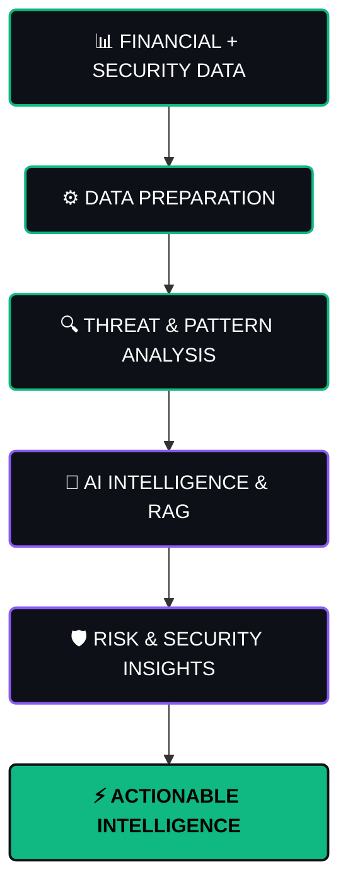

```html
<div align="center">
  
  
  <br><br>

  <!-- Enhanced Typing SVG with More Dynamic Skills -->
  
  
  <br><br>

  <p>
    <a href="https://github.com/sramasu"></a>
    <a href="https://www.linkedin.com/in/sravan-v-905534384"></a>
    <a href="mailto:sravanv2611@gmail.com"></a>
    <a href="https://www.codechef.com/users/sravan_20_06"></a>
    <a href="https://leetcode.com/u/V_SRAVAN_REDDY/"></a>
  </p>

  <p>
    
    
    
  </p>
  
  
</div>

## 👋 About Me

```bash
$ whoami
> A developer turning ambitious ideas into useful, intelligent systems.

$ cat focus.txt
> AI · LLM Engineering · Full-Stack · Cybersecurity · Cloud · Data
```

I am a Full-Stack Developer and AI/ML Engineer based in Bengaluru, India. My work lives at the intersection of artificial intelligence, LLM engineering, modern web development, cybersecurity, data analytics, cloud infrastructure, DevOps and blockchain analytics.

I enjoy solving hard problems, competing in coding contests, and turning ambitious ideas into practical, secure systems that people can actually use.

<div align="center">
  <h4><code>LEARN → BUILD → TEST → SECURE → DEPLOY → SCALE</code></h4>
  
</div>

## 🧰 Technology Arsenal

<table>
  <tr>
    <td width="50%" valign="top">
      <h3><code>&lt;/&gt;</code> Languages & Runtimes</h3>
      
      
      
      
      
      
      
    </td>
    <td width="50%" valign="top">
      <h3>🤖 AI & ML Engineering</h3>
      
      
      
      
      
      
      
    </td>
  </tr>
  <tr>
    <td width="50%" valign="top">
      <h3>🌐 Web Architecture</h3>
      
      
      
      
      
      
      
    </td>
    <td width="50%" valign="top">
      <h3>🛡️ Cybersecurity Ops</h3>
      
      
      
      
      
      
      
    </td>
  </tr>
  <tr>
    <td width="50%" valign="top">
      <h3>☁️ Infra, Cloud & DevOps</h3>
      
      
      
      
      
      
    </td>
    <td width="50%" valign="top">
      <h3>🗄️ Data & Blockchain Systems</h3>
      
      
      
      
      
      
    </td>
  </tr>
</table>

<div align="center">
  
</div>

## 📈 GitHub at a Glance

<!-- FIXED AND UPGRADED STATS SECTION -->
<div align="center">
  <a href="https://github.com/sramasu">
    
  </a>
  <a href="https://github.com/sramasu">
    
  </a>
  
  <br><br>
  
  <a href="https://github.com/sramasu">
    
  </a>

  <br><br>
  
  <a href="https://github.com/sramasu">
    
  </a>
</div>

<p align="center"><i>Note: Language cards show the languages used in public repositories — not experience level or proficiency.</i></p>

<div align="center">
  
</div>

## 🚀 Featured Build: SENTINEL-FIN

<div align="center">
  
  
  
  
</div>

<br>

> **AI-Powered Financial Cybersecurity System**  
> A security-focused system concept combining AI/ML, financial intelligence, threat detection, analytics, and cybersecurity operations — transforming raw data into actionable risk intelligence.

<!-- STYLED MERMAID DIAGRAM -->


<div align="center">
  
</div>

## 🏅 Professional Certifications

<table>
<tr>
<td width="50%" valign="top">
<b>🛡️ Google Cybersecurity — Google</b><br>
Security frameworks, network security, security operations and incident response.<br>
<code>Cybersecurity</code> <code>Network Security</code> <code>SOC</code>
<br><br>
<b>⚙️ Google IT Automation with Python — Google</b><br>
Python scripting, automation, operating systems, Git and version control.<br>
<code>Python</code> <code>Automation</code> <code>Git</code>
<br><br>
<b>🌐 Full Stack Software Developer — IBM</b><br>
Cloud-native architectures, React, Node.js and backend development.<br>
<code>Full Stack</code> <code>React</code> <code>Node.js</code> <code>Cloud</code>
</td>
<td width="50%" valign="top">
<b>✨ Generative AI Fundamentals — Google</b><br>
Generative AI foundations, transformer architecture and prompting concepts.<br>
<code>Generative AI</code> <code>Transformers</code> <code>Prompting</code>
<br><br>
<b>🚀 DevOps Foundation — Infosys</b><br>
CI/CD pipelines, containerization and deployment automation.<br>
<code>DevOps</code> <code>CI/CD</code> <code>Containers</code>
<br><br>
<b>🔐 Ethical Hacking with Open Source Tools — IBM</b><br>
Offensive security tooling, reconnaissance and defensive countermeasures.<br>
<code>Ethical Hacking</code> <code>Open Source</code>
</td>
</tr>
</table>

<details>
<summary><b>🔽 View all 22 programs, certifications and learning milestones</b></summary>

| # | Program / Certification | Focus |
| :--- | :--- | :--- |
| 01 | 🤖 AI Agent Developer — Vanderbilt University | AI Agents |
| 02 | ✨ Outskill Generative AI Mastermind | Generative AI |
| 03 | ☁️ AWS Cloud Technology Consultant | Cloud |
| 04 | 📊 ChatGPT: Excel & Personal Automation with GPTs | AI Automation |
| 05 | 🧠 ChatGPT: Master Free AI Tools to Supercharge | AI Productivity |
| 06 | 🛡️ Code ER — Bug Hunting Competition | Cybersecurity |
| 07 | ⚙️ Generative AI Automation — Vanderbilt University | Generative AI |
| 08 | 📊 Generative AI Data Analyst — Vanderbilt University | AI / Data |
| 09 | 🗄️ Generative AI SQL Database Specialist | SQL / AI |
| 10 | 🎯 Generative AI Strategic Leader — Vanderbilt | AI Strategy |
| 11 | 🔎 Getting Started with Threat Intelligence & Hunting | Threat Intel |
| 12 | ☁️ Google Cloud Career Launchpad — Cybersec | Cloud Security |
| 13 | ✨ Google Cloud Intro to Gen AI Learning Path | Generative AI |
| 14 | 🛡️ Google Cybersecurity | Cybersecurity |
| 15 | 🐍 Google IT Automation with Python | Python / Automation|
| 16 | 🔐 IBM Ethical Hacking with Open Source Tools | Ethical Hacking |
| 17 | 🌐 IBM Full Stack Software Developer | Full Stack |
| 18 | 🤖 IBM RAG and Agentic AI | AI / LLM |
| 19 | 🚀 Infosys DevOps Foundation Certification | DevOps |
| 20 | 🛡️ Microsoft Cybersecurity Analyst | Cybersecurity |
| 21 | 🍃 MongoDB Certifications | Database |
| 22 | 🏢 Security Operations Center in Practice | SOC / Cybersec |

</details>

<div align="center">
  
</div>

## 🧩 Engineering Philosophy

```python
class SravanReddy:
    roles = [
        "Full-Stack Developer",
        "AI/ML Engineer",
        "Cybersecurity Enthusiast",
    ]

    domains = [
        "Artificial Intelligence",
        "LLM Engineering",
        "Cybersecurity",
        "Full-Stack Development",
        "Cloud & DevOps",
    ]

    workflow = "LEARN → BUILD → TEST → SECURE → DEPLOY → SCALE"

    def build(self, idea):
        """Security is not an afterthought — it is part of the architecture."""
        return self.learn(idea).secure().ship().scale()
```

<div align="center">
  
</div>

## 📬 Let's Connect

<div align="center">
  <h4>⚡ BUILD · SECURE · AUTOMATE · INNOVATE</h4>
  <i>Turning ideas into intelligent systems.</i>
</div>

<br>

<div align="center">
  <a href="mailto:sravanv2611@gmail.com">
    
  </a>
  <a href="https://github.com/sramasu">
    
  </a>
  <a href="https://www.linkedin.com/in/sravan-v-905534384">
    
  </a>
  <a href="https://leetcode.com/u/V_SRAVAN_REDDY/">
    
  </a>
</div>

<br>

<div align="center">
  <code>📍 Bengaluru, Karnataka, India</code>
  <br><br>
  
</div>
```
